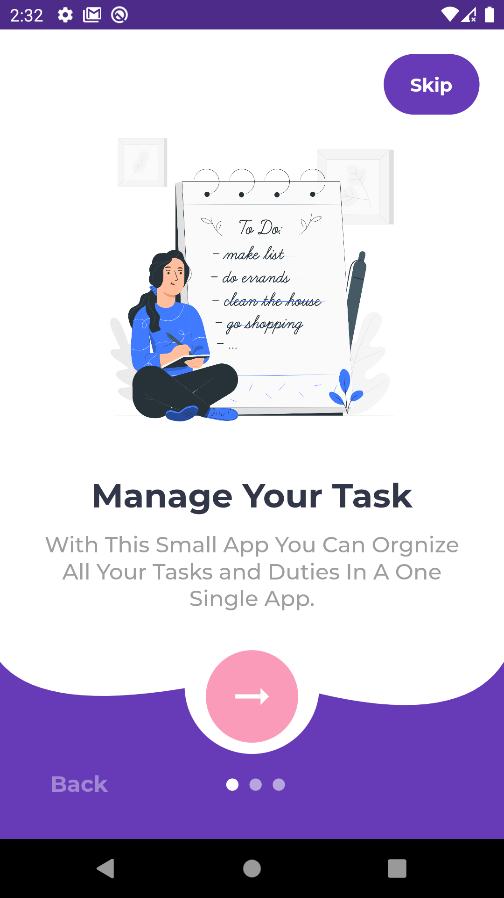
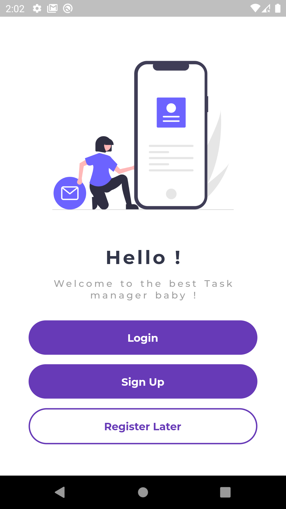
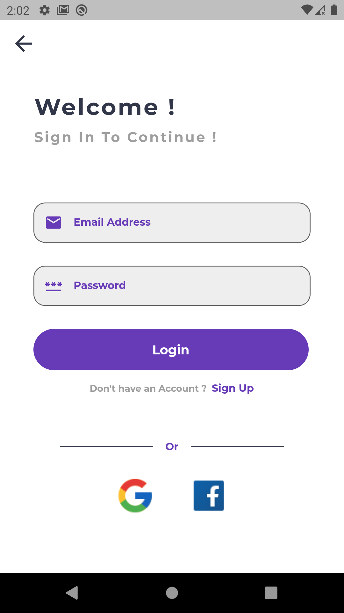
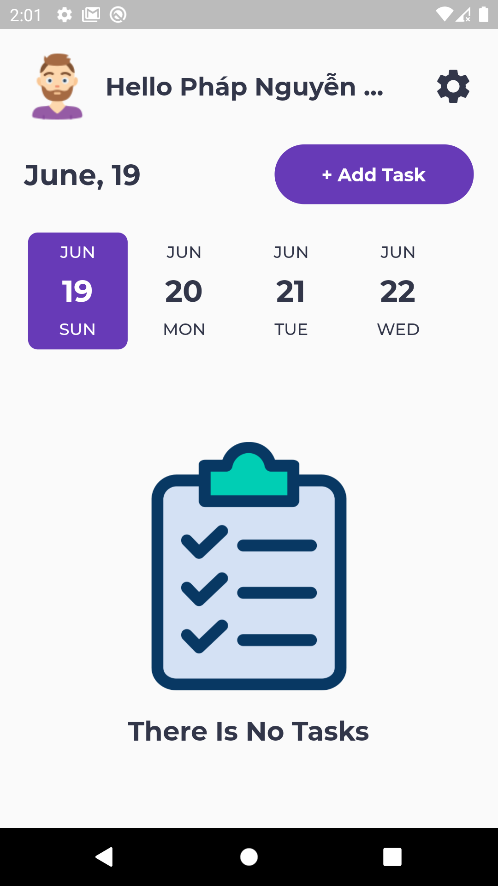
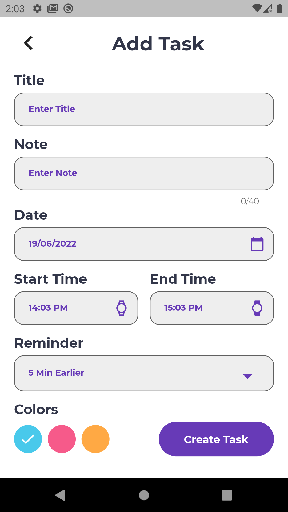
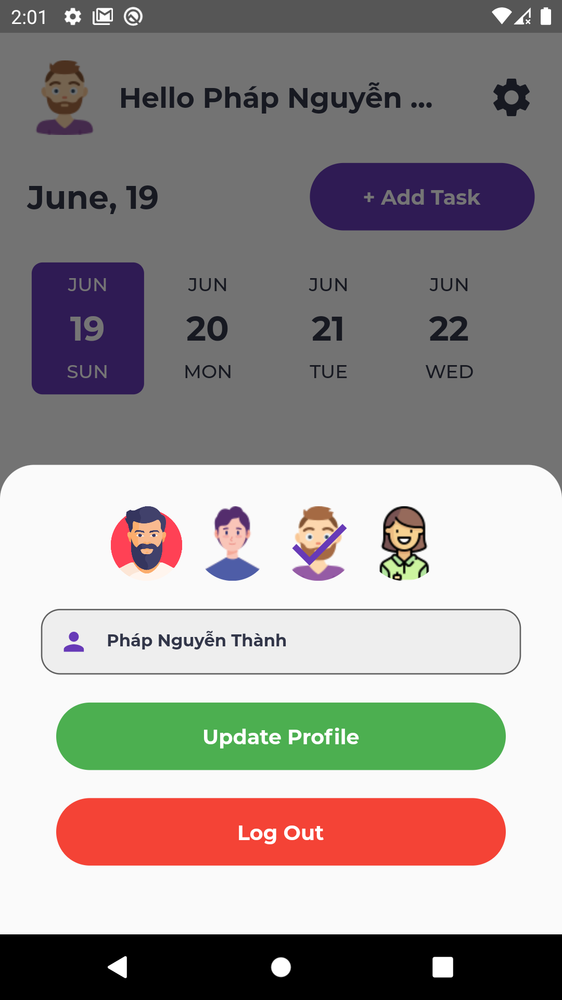

# 🔥 Todo App

An App To manage all your tasks with firebase backend.

## ✨ Features :
- Login/SignUp with Firebase.
- Login/SignUp with Google Account.
- You don't have to login (Anonymous Mode).
- CRUD Tasks.
- Beautiful UI.
- Firebase cloud as Backend to save todos.
- Save users login state with local storage Shared Preference
- Beautiful Animation.
- The App will notify you when a task begins/ends.

## 📸 Screenshots :

   
 


### Testing```sh
$ sh sh/run_test.sh
```

### Testing```sh
$ sh sh/run_test.sh
```